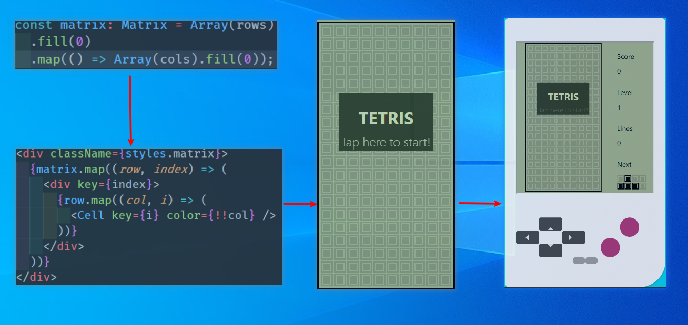

## 游戏规则
控制掉落的方块，填满水平行使其消失，尝试尽可能多的消除不断掉落的方块

[项目demo](https://redux-tetris.netlify.app/)


## 心路历程
最早是希望能有个小项目可以时不时拿来练练新出的技术，不然一直抄demo，过眼不过脑。
阅读了[用React、Redux、Immutable做俄罗斯方块](https://github.com/chvin/react-tetris)，后决定就这个项目了。然后开始读源码，试图重新造轮子。从文件夹开始，标注每一个文件夹大致是对应哪一块业务，再一步步细分到文件、文件中的函数，拆解完后。。。2周，我感觉2周就能搞定这个项目。。。但是真正码起来却是：

卧槽，这里有个细节得打磨打磨！

欸，这样式排版要搞好还得充充电！

啊，事件整一块原来这么麻烦！

不行，这样写太啰嗦，我要重构！

时间悄咪咪就过去了，回头一看，mud, almost 2 month

真正写的时候，发现其实这个游戏简单的操作后面都是强大的逻辑在做支撑，中间踩了不少坑，像是伪随机、旋转、踢墙，以及最基本的方块的构建，都下了不少功夫。前面[chvin](https://github.com/chvin/react-tetris)的代码还能参考参考，后面基本上都是自己的思路了，轮子也不是说造，那么简单就能造的啊！

最后，写完感觉自己进入了贤者模式。


## 术语统一
特地写了个术语描述栏目，方便对业务进行描述，以及后续编程时进行命名
| 术语           | 别名              | 描述                                      |
| -------------- | ----------------- | ----------------------------------------- |
| 方块（数组）   | tetromino,tetrads | 俄罗斯方块的简称                          |
| 方块（对象）   | pieces            | 俄罗斯方块的简称                          |
| 方块填充       | blocks,filled     | 方块展示在矩阵上                          |
| 方格           | cell,minoes       | 组成矩阵的小格子                          |
| 矩阵           | matrix            | 由行（rows）和列（columns）组成的2维界面  |
| 形状           | shape             | 4个方块的基本排列方式                     |
| 方向           | direction,direct  | 方块的朝向，也是相对基本排列旋转90°的次数 |
| 摇杆           | joystick          | 控制方块的按钮                            |
| 游戏场地       | playField         | 游戏内容的主要展示界面                    |
| 移动点（坐标） | point,location    | 通过x轴和y轴来确定矩阵上移动的点          |
| 定位点         | origin,position   | 相对位置                                  |
| 计分板         | scoreboard        | 展示方块得分                              |


## 编码思路

基于`create-react-app` 这个脚手架搭建，轻度使用了`typescript` ，重度使用了`redux-toolkit` 。`ts` 让代码更加可读，`redux-toolkit` 则是集成了常用的全家桶，例如`thunk` ,`reselector` ,`immer` 等，这样延迟计算、记忆函数、不可变等*新鲜特性*都可以很方便的使用了。

```shell
npx create-react-app my-app --template redux-typescript
```

使用脚手架后省去了配置`webpack` 的烦恼，集成的工具库刚好够使用，这样就可以将精力都放在功能实现上了。

一开始考虑的东西不要太多太复杂，不然难以提笔。直接**从最核心的部分开始**，也就是矩阵和方块，考虑用怎样的数据结构来实现。以此为圆心，交互为半径，整个功能开发向周边扩散。虽然很多文章说，考虑清楚了再开发，时间80%在思考20%在编码。但真实的情况是，你硬是要想，只能发现硬不起来。没有实际可运行的代码，再多的想法都是空中楼阁。思考和编码的比例并不重要，将复杂的问题拆解后，编码即是思考，思考即是编码。

### 第一步明确要处理怎样的数据

2维数组天然适合这种行和列的单元格展示，但是渲染方块的移动，key-value结构的对象会更合适。

* 矩阵和方块均由2维数组构建，1和0分别表示有无填充。
* 压缩2维数组为key-value结构，value用数组存储方块所在下标。e.g. {1:[5,6,7]}表示第一行的5、6、7格有方块填充

强调一下为什么不统一用2维数组：
1. 2维数组映射成`dom` 后，不需要直接操作`dom` ，只需要更改`dom` 上的color属性。
2. key-value结构可以很轻松的表示方块降落到了底部第20行，而2维数组做同样的表示还得有19行的0做陪跑。
3. 根据算法知识，合理压缩过的数据，可以用更少的遍历来到达同样的效果，在性能上会更有优势。
4. `react` 和`redux` 均建议**找出应用所需state的最小表示**，然后计算出其它所需要的数据。

确定了2维数组后，就可以依此将整个静态的游戏界面`css` 出来了



对于方块，2维数组能在视觉上有更为直观的表达。然后可以通过坐标{x,y}来表示方块掉落到矩阵哪个位置。比如[[1,1,1,1]] 和 {4,7} 就可以表示为在矩阵第7行第4列有个形状为 'I' 的方块。

以上，便确定了矩阵使用2维数组布局，使用对象渲染掉落的方块；方块使用2维数组表示形状，结合坐标{x,y} 来表示如何展示在矩阵上。

### 第二步拆解复杂的交互动作

矩阵是静态的，当方块掉落进来才有了一系列的展示和消除，所以首先关注方块的操作。对方块的操作主要有3类，降落、旋转和左右移动，对应的代码应该也至少拆分为3块逻辑。

降落和平移是改变方块的位置，而旋转是改变方块的形状。**位置的改变很简单，变量`xy` 做加减法就可以了**。而**形状却需要改变表示方块的2维数组**。拿方块'L' 举例，经过逆时针旋转最终会有4种展示：

```javascript
L0: [
    [0, 0, 1],
    [1, 1, 1],
],
L1: [
    [1, 1],
    [0, 1],
    [0, 1],
],
L2: [
    [1, 1, 1],
    [1, 0, 0],
],
L3: [
    [1, 0],
    [1, 0],
    [1, 1],
]
```

能十分直观的看到，下一次的旋转，就是上一次的行变成了列，并是从后往前变的 ，依此可以编写一个按顺时针旋转的函数。

```javascript
var rotate = (tetrads) => {
    return tetrads
        .reduce((acc, item) => {
            item.forEach((v, k) => {
                if (acc[k] === undefined) {
                    acc[k] = [];
                }
                // 转换行和列
                acc[k].push(v);
            });
            return acc;
        }, [])
        .reverse(); // 由后往前反转行
};
```

其它形状的方块也都遵从这样的旋转规则，那么顺时针呢？又要这样走一遍么。这里我略作思考（想了半天），大胆的决定，只使用一个旋转函数（再来一遍太痛苦了），来**缓存当前方块的所有旋转结果**，再通过一个**表示上下左右4个方向的变量**`direct` 来索引旋转结果。此时，`redux` 只需要极其精简的两个变量就能表示出复杂的旋转结果了。

```json
  tetromino: {
    currentShape: 'L',
    direct: 1,
    }
```
可以表示为
```javascript
L1: [
    [1, 1],
    [0, 1],
    [0, 1],
],
```

顺时针旋转，direct自增；逆时针旋转，direct自减。瞬间被自己的机智所折服。。。

拿着旋转后的数组和坐标{x,y}，再通过转换函数就能得到方块展示在矩阵上的各个形状了。但是这里还存在着bug，因为**坐标需要始终位于方块的中心**，然而方块与方块之间不能一概而论。so, 在转换数组为对象前，对方块的每个形状，需要**加入一个偏移量** 来改变方块于坐标{x,y}的相对位置。这样，坐标的值不需要改变，数组是通过中点掉落到矩阵中。

```javascript
// 每个形状中点移动的值不同
var midPoint = {
    I: [-1, 0],
    L: [-1, -1],
    J: [-1, -1],
    Z: [-1, -1],
    S: [-1, -1],
    O: [0, -1],
    T: [-1, -1],
}

var getOffset = (
    { x, y },
    offset,
) => {
    return {
        x: x + offset[0],
        y: y + offset[1],
    }
}
```

本来挺复杂的方块旋转问题就这样拆解开并各个击破了。如何操作方块的问题解决了，但是**方块在什么情况下能被操作**呢？

1. 没有被其它方块阻塞 
2. 没有超出矩阵边界

三个动作两个条件，继续拆！

要知道是否被阻塞，其实就是**预测方块下一步**是否和矩阵中已填充的方块存在交点。简要说明一下，如果是左移则x-1，是软降y-1，是左转direct-1，然后转化成对象判断是否存在交点，是就不能做该操作。

超出边界则是**判断当前方块**，判断每一小块是否小于矩阵的边界高20宽10。至此整个方块的交互最核心的部分得以实现。

### 第三步通过数据与交互构建功能

根据一、二步的信息，可以让键盘和按钮绑定上对应的操作，此刻这个项目便能“动”了起来。以此可以**再深入拓展**游戏界面`playfield` 的功能。其主要功能为自动降落，方块填充与消除、游戏开始和结束窗口展示。自动降落使用计时器`setInterval` 设置一个时间变量来不断触发软降。

但这个模块的难点并不在计时器`setInterval` 的使用，而是动作的触发以及状态的扭转。需要计算是否阻塞-->是否触底-->是否溢出。捋顺了说，触底和阻塞都会触发方块填充，填充后需要判断是否溢出，是则游戏结束，否则继续降落。

如果游戏结束了，就从前面的动作触发变为开始结束的状态扭转，并依托于重置、暂停两个功能。重置功能就是清除数据并初始化，没太多好说的。

而无论开始还是结束，游戏都处于暂停状态。如果用false表示结束，true表示开始，那么暂停时通过计算这一Boolean变量就能判断该展示开始界面还是结束界面。也就是计算已填充的方块是否超出矩阵的高度，超过了则改变Boolean变量为false，暂停游戏并弹窗结束界面。

如果要让组件处理逻辑更加纯粹，那么这里的逻辑会拆分到3个文件（组件）内执行：

* 一个文件使用计时器`setInterval` 实现自动降落
* 一个文件只处理方块渲染，包括填充与清除
* 一个文件做开始和结束的弹窗画面

思路大致就写到这里了，这三步基本攻破核心内容，后续的功能添加就可以按照一定的迭代计划，周期性的慢慢添加了。[俄罗斯方块指南](https://tetris.fandom.com/wiki/Tetris_Guideline) 有着对其功能丰富的说明。


## 亮点片段

某些功能的实现，自我感觉良好，所以拎出来单独表扬（狗头）。

### 伪随机系统

官方推荐的是一个叫7-bag的伪随机系统，类似于每次从包里拿出一个小球，小球一共有7个且颜色各不相同，拿完之后把小球放回重新拿。

```javascript
const randomGenerator = () => {
  let bag = 'OISZLJT'.split('') as Shape[];
  let tmp: number[] = []
  return function () {
    if (tmp.length === 0) {
      tmp = Array.from({ length: bag.length }, (_, i) => i)
    };
    const result = tmp.splice(Math.floor(Math.random() * tmp.length), 1)[0]
    return bag[result];
  }
}

let bag = randomGenerator()
```

这里利用`js` 闭包特性，让调用对象**记住**了包里还剩几个球。

### 缓存旋转结果

方块有顺时针和逆时针两种旋转，但是旋转的结果最多也就上下左右四种，所以缓存起来再通过下标来访问，就不用每次调用函数进行旋转了。

```javascript
const rotateCache = (item: Tetromino) => {
    let items = [item];

    for (
        // rotate是旋转方块的函数
        let i = rotate(item);
        items[0].length !== i.length ||
        // 判断2维数组是否相等
        items[0].some((x, y) => x.some((m, n) => i[y][n] !== m));
        i = rotate(i)
    ) {
        items.push(i);
    }
    return items;
};
```

只要写一个旋转函数，通过这个函数判断这一次和上一次的旋转结果是否相同。不同则缓存，相同则返回结果。虽然代码就是一个for循环，但是这个思路我的确琢磨了不少时间。

### 预测移动结果

数据进行压缩后，只需要形状，方向和坐标就能表示出方块在矩阵中的展示。如果将方向和坐标抽出来作为函数的参数，那么修改这个参数，就能非常方便的获取到方块操作的结果。

```javascript
/*...只展示核心代码*/
export const selectTetrominoCreator = createSelector(
    (state: RootState) => state.tetromino.currentShape,
    // 返回一个结束方向和坐标的函数，便于计算任意操作下的方块
    (shape) => (direct: Direction, point: Point) => {
        // 获取当前方向的方块
        const tetrad = getTetrad(shape, direct)
        // 矫正方块的相对位置
        point = getOffset(point, midPoint[shape])
        // 将方块从2维数组转换成对象
        return convertToBlocks(tetrad, point)
    }
)

export const selectForecast =  createSelector(
    selectTetrominoCreator,
    (state: RootState) => state.tetromino.direct,
    (state: RootState) => state.tetromino.point,
    (state: RootState) => state.playfield.filled,
    (tetrads, direct, point, filled) => (
        next: string,
        step: number,
    ) =>{
        // 保存当前步骤
        let nextPoint = { ...point }
        let nextDirect = direct
        // 确定方块操作
        switch (next) {
            case 'move':
                nextPoint.x += step
                break;
            case 'drop':
                nextPoint.y += step
                break;
            case 'rotate':
                nextDirect += step
                break;
            default:
                throw new Error(`only have move,drop,rotate to control`);
        }
        const tetrad = tetrads(nextDirect, nextPoint)
        // 判断下一步是否有移动空间
        return isVacated(tetrad, filled)
    }
)
```

上面是伪代码，直接传入当前的方向和坐标，就是矩阵上展示的方块。如果对方向和坐标进行修改，就能提前得到方块移动后的结果了。


## 目录结构
`common`  工具代码、注释代码等弱业务相关

`components`  组件，基本渲染组件，不参与最终交互

`features`  功能区，业务逻辑主要目录，内部划分：
* 每个功能区只处理同一类型的业务
* 动作跟着状态走，共享状态就抽出来做更高一层


## 心得体会

尽量避免直接编写函数对业务进行处理。思考业务对应的数据类型，对此数据类型进行函数处理。业务发生变动，如果是数值变化，可能只需要修改相应参数；如果变动巨大，也只需要对单个函数进行修改，原来的代码结构不会受影响。

提供给外界调用的函数，先封装一层，再export出去。这样即使代码重构，比如被封装函数的名字改了，外界调用也不会受影响。所以`API` 的函数签名十分重要，一旦被外部引用，你就不能随心所欲的对它进行修改了。

一开始编写代码时不一定非要高度抽象，面向过程的编码也是不错的，因为思考的负担很小。在功能实现后，再来对过程进行抽象。太早思考最终方案和最佳实践，即使大脑的算力能跟上，大脑的存储可跟不上。

封装数据处理逻辑一致的代码，而不是封装相似程度高的代码。虽然大部分情况下，封装长得一样的代码没错，但知道这里代码为什么相似，会让封装的意义更明确，封装的也更彻底。


## Available Scripts

In the project directory, you can run:

* `npm start`
* `npm test`
* ~~`npm run build`~~
* ~~`npm run eject`~~


## 迭代计划
TODO 核心功能
* 得分榜
* 恢复游戏给出3秒倒计时

TODO 非核心功能
* 音乐
* 填充动画、消除动画
* 数据缓存
* 是否聚焦

TODO 重构
* 可以用构造函数，使矩阵数据聚合性更强。用promise完成链式关系的事件，逻辑会更清晰。
* 使用`material-UI` ,`react-hotkeys` 使得UI交互代码更直观
* 考虑使用`rxjs` ,`lodash` 简化工具代码